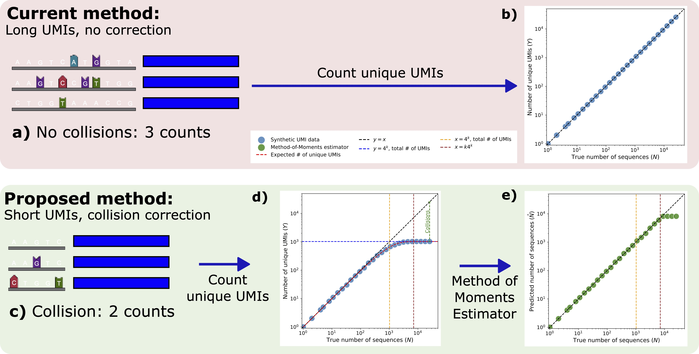

# Unique molecular identifiers don't need to be unique: a collision-aware estimator for RNA-seq quantification

Dylan Agyemang, Rafael A. Irizarry, Tavor Z. Baharav. doi: https://doi.org/10.1101/2025.09.08.674884

## Overview 
RNA-sequencing (RNA-seq) relies on Unique Molecular Identifiers (UMIs) to accurately quantify gene expression after PCR amplification. Longer UMIs minimize collisions---where two distinct transcripts are assigned the same UMI---at the cost of increased sequencing and synthesis costs. However, it is not clear how long UMIs need to be in practice, especially given the nonuniformity of the empirical UMI distribution. In this work, we develop a method-of-moments estimator that accounts for UMI collisions, accurately quantifying gene expression and preserving downstream biological insights. We show that UMIs need not be unique: shorter UMIs can be used with a more sophisticated estimator. 


<p align="center">
	
</p>


**Comparison between the standard pipeline and our collision-aware estimator (synthetic data):**

**a)** With long UMIs (k=12) collisions are rare. All 3 transcripts are assigned a different UMI, and so deduplication yields 3 counts.

**b)** Deduplicated UMI counts accurately predict the true number of transcripts for long UMIs.

**c)** With short UMIs (k=5) collisions will occur. Here, 3 transcripts are sequenced, but 2 are assigned the same UMI, leading to a deduplicated count of 2.

**d)** Deduplicated UMI counts fall far below the y=x line due to collisions. Our statistical model (red line) accurately predicts this observed relationship.

**e)** Our method-of-moments estimator applied to d corrects for these collisions.


## Repository Structure  
- `figures/` – Figures generated from results for each RNA-seq dataset  
- `main_scripts/` – Core scripts required to reproduce experiments  


## Minimal Working Example

This repository includes a minimal working example for correcting UMI counts for collisions using a non-uniform, collision-aware estimator, as described in the accompanying bioRxiv manuscript. A small AnnData object is provided to allow the example to run out of the box.

To run the minimal working example, execute:

```bash
python minimal_working_example/minimal_working_example.py
```
For a description of available options and arguments, run:

```bash
python minimal_working_example/minimal_working_example.py -h
```
 
